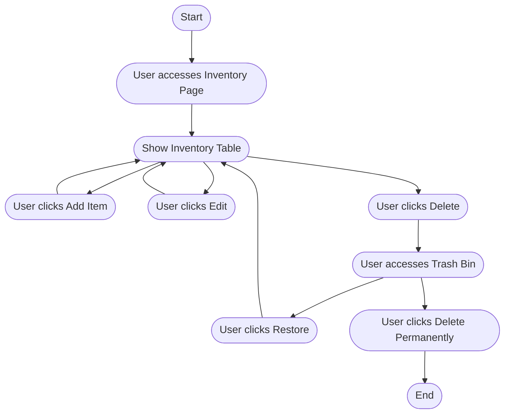

# PHP Inventory CRUD

## Deskripsi Proyek

**PHP Inventory CRUD** adalah aplikasi web sederhana untuk mengelola data barang menggunakan PHP, MySQL, dan Bootstrap. Proyek ini mendemonstrasikan fitur CRUD (Create, Read, Update, Delete) dengan tambahan fitur **Trash Bin** (soft delete) untuk mengelola data yang dihapus sementara sebelum dihapus permanen.

## Fitur Utama

- **Tambah Barang**: Input data barang baru beserta foto.
- **Lihat Barang**: Tampilkan daftar barang dalam tabel responsif.
- **Edit Barang**: Ubah data barang yang sudah ada.
- **Hapus Barang (Soft Delete)**: Barang yang dihapus akan masuk ke Trash Bin, bukan langsung terhapus dari database.
- **Trash Bin**: Lihat dan kelola barang yang sudah dihapus (restore atau hapus permanen).
- **Upload Foto**: Setiap barang dapat memiliki foto yang diunggah ke folder `uploads`.
- **Pencarian**: Cari barang berdasarkan kata kunci.
- **Notifikasi**: Tampilkan notifikasi untuk aksi tambah, edit, hapus, restore, dan hapus permanen.
- **Statistik**: Tampilkan jumlah total barang dan barang terbaru.

## Struktur Folder

```
php-inventory-crud/
├── config/
│   └── db.php
├── includes/
│   ├── header.php
│   ├── footer.php
│   └── functions.php
├── uploads/
│   └── [file gambar barang]
├── index.php
├── trash.php
├── style.css
└── README.md
```

## Penjelasan File Utama

- **config/db.php**  
  Koneksi ke database MySQL.

- **includes/functions.php**  
  Berisi fungsi-fungsi utama: tambah, edit, hapus (soft delete), restore, hapus permanen, dan pengambilan data barang.

- **includes/header.php & footer.php**  
  Template HTML untuk header dan footer, termasuk Bootstrap dan script interaktif.

- **index.php**  
  Halaman utama untuk menampilkan, menambah, mengedit, dan menghapus barang.

- **trash.php**  
  Halaman untuk melihat barang yang sudah dihapus (soft delete), melakukan restore, atau hapus permanen.

- **uploads/**  
  Folder penyimpanan file gambar barang.

- **style.css**  
  Custom styling untuk tampilan aplikasi.

## Cara Kerja

1. **Menambah Barang**

   - Isi form tambah barang di halaman utama.
   - Data dan foto barang disimpan ke database dan folder `uploads`.

2. **Menampilkan Barang**

   - Barang yang belum dihapus (is_deleted=0) ditampilkan di tabel pada halaman utama.

3. **Mengedit Barang**

   - Klik tombol edit pada baris barang, ubah data, dan simpan.

4. **Menghapus Barang (Soft Delete)**

   - Klik tombol hapus pada baris barang.
   - Barang tidak langsung dihapus dari database, tapi dipindahkan ke Trash Bin (is_deleted=1).

5. **Trash Bin**

   - Barang yang dihapus dapat dilihat di halaman `trash.php`.
   - Barang bisa direstore (is_deleted=0) atau dihapus permanen (row dihapus dari database dan file foto dihapus dari folder).

6. **Upload Foto**

   - File foto barang disimpan di folder `uploads/` dan path-nya disimpan di database.

7. **Notifikasi**

   - Setiap aksi (tambah, edit, hapus, restore, hapus permanen) akan menampilkan notifikasi di pojok kanan atas.

8. **Statistik**
   - Jumlah barang dan barang terbaru ditampilkan di bagian atas halaman utama.

## Database

struktur tabel `item_table`:

```sql
CREATE TABLE item_table (
    id INT AUTO_INCREMENT PRIMARY KEY,
    nama_barang VARCHAR(255) NOT NULL,
    tgl_pembelian DATE NOT NULL,
    nomor_seri VARCHAR(100) NOT NULL,
    foto VARCHAR(255),
    is_deleted TINYINT(1) DEFAULT 0
);
```

## Program Flowchart



## Catatan

- Penggunaan & Modifikasi: Proyek ini bebas digunakan dan dimodifikasi oleh siapa saja sesuai kebutuhan. Silakan kembangkan untuk keperluan pribadi, belajar, atau komersial.

- Kontak & Kredit: Untuk pertanyaan, kolaborasi, atau info lebih lanjut, silakan hubungi pembuat di Instagram: [@feintzz333](https://instagram.com/feintzz333)

